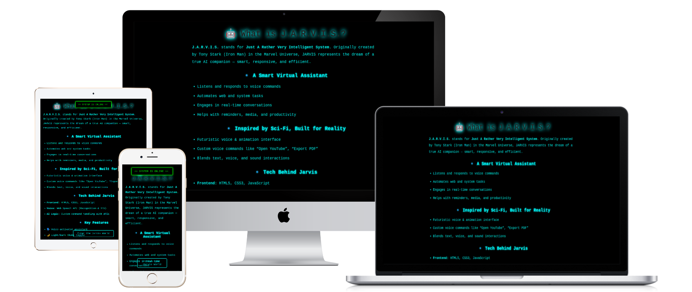

# 🤖 JARVIS Assistant – AI Voice-Powered Web Assistant

A futuristic, voice-controlled smart assistant inspired by Iron Man's J.A.R.V.I.S. 
Built using HTML, CSS, and JavaScript with speech recognition, command execution, and assistant personality.

---

## ⚙️ Project Overview

**JARVIS Assistant** is an interactive chatbot powered by web technologies that:
- Understands voice commands
- Responds with speech
- Executes common browser tasks
- Delivers a futuristic UI experience

---

## 🚀 Features

- 🎤 Voice recognition using Web Speech API
- 🧠 Smart command execution (open sites, say time, search)
- 🗣️ Text-to-speech (Jarvis-style voice feedback)
- ⌨️ Type + Speak input support
- 🎨 Futuristic animated UI (Jarvis-style)
- 📄 Export chat history as PDF
- 🌓 Dark/Light mode toggle
- 🔁 Reset & clear assistant memory
- 🧠 Remembers user name from startup prompt

---

## 📦 Folder Structure

jarvis-assistant/ ├── index.html                # Main UI ├── README.md                 # Documentation ├── style.css                 # Optional external styles ├── script.js                 # Optional external JS └── sounds/                   # Audio feedback folder ├── startup.mp3 ├── time.mp3 ├── search.mp3 ├── open_google.mp3 ├── unknown_command.mp3

---

## 🛠 How to Use

1. **Download or Clone**
   ```bash
   git clone https://github.com/harshadteli/jarvis-assistant-aitechnology.git

2. Open in Browser Just open index.html in any modern browser.


3. Grant Microphone Access For voice recognition, allow mic permission when prompted.


---

🧪 Voice Commands Supported


- hi / hello / hey / how are you / whats up
- play music / pause music
- open google / open instagram / open youtube
- what is / what are / who is / who are + < your query >
- wikipedia + < your query >
- time / date
- open calculator


---

💡 Built With

HTML5

CSS3

JavaScript

Web Speech API (Recognition + Synthesis)

jsPDF for PDF export


---

📤 Export Chat

Click the Export Chat button or say "Export chat"

A .pdf file is saved with your entire conversation

A confirmation popup shows download success


---

📷 Screenshots





---

🌐 Browser Compatibility

Browser Voice Support

Chrome ✅ Full
Edge ✅ Full
Firefox ❌ No voice recognition
Safari ❌ Limited


---

## 🖥️ Live Demo

[](https://harshadteli.github.io/jarvis-assistent-aitechnology/)

---

📧 Author

- Harshad Teli<br>
Crafted with 💡, JavaScript & love for Iron Man fans.


---

## 🔗 Connect with Me

[](https://github.com/harshadteli)
[](https://www.linkedin.com/in/harshad-teli-560700330?utm_source=share&utm_campaign=share_via&utm_content=profile&utm_medium=android_app
)
[](https://www.instagram.com/ha.rshad4727?igsh=MTlmbHFkMTlnMnh2dQ==)
[](mailto:harshadteli697@gmail.com)
[](https://harshadteli.github.io/contactharshadteli/)
[](https://harshadteli.github.io/harshadteliportfolio/)
[](https://youtube.com/@harshtechaiworld?si=atZyhy8X8SAHiupw)

---

📜 License

This Project do not required any License.

---

&copy; 2025 HarshTech Organization | All rights reserved


